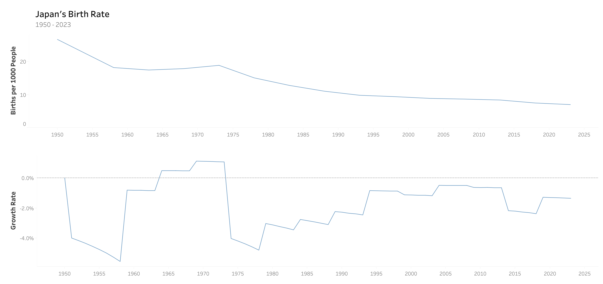

# Japan-Birth-Rate

**[In Progress]**

Source of the Dataset: https://www.macrotrends.net/countries/JPN/japan/birth-rate

Tableau Dashboard: https://public.tableau.com/app/profile/richton/viz/JapanBirthRate/Dashboard1

## Introduction

Japan is a country with a rich cultural heritage and a rapidly aging population, with one of the lowest birth rates in the world. One of the critical demographic indicators that have significant implications for the country's future is the birth rate and the population growth rate. The birth rate reflects the number of births in a given year relative to the total population size, while the population growth rate measures the increase or decrease in the population size over a specified period. In this analysis, we will investigate Japan's population birth rate and growth rate between the years 1950 and 2023.

## Insights

- The overall birth rate in Japan has been declining since the 1970s, with a particularly steep decline in the 2000s. This trend is reflected in both the total number of births and the birth rate per 1000 people.
